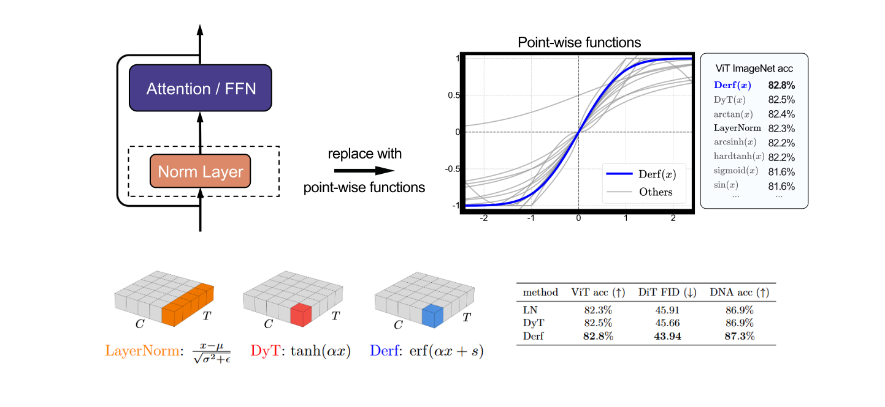

# Stronger Normalization-Free Transformers

This repository provides a modular PyTorch implementation of **Dynamic erf (Derf)**

--- 

<p align="center">

</p>

**Dynamic erf (Derf)** is a simple point-wise function: $\mathrm{Derf}(x) = \mathrm{erf}(\alpha x + s)$, where $\alpha$ and $s$ are learnable scalars.  
Derf is designed as a drop-in replacement for normalization layers in Transformers, and achieves stronger performance than LayerNorm, RMSNorm, and Dynamic Tanh across a wide range of modalities and tasks.

## Implementation
We evaluate Derf across four **representative Transformer model families** and one other modern architecture, strictly **following their official implementations**. 

- **[DiT](DiT/)** - Diffusion Transformer for image generation
- **[ViT](ViT/)** - Vision Transformer for image classification
- **[Speech Model](speech%20model/)** - Speech recognition and processing
- **[DNA Model](DNA%20model/)** - Genomic sequence modeling
- **[Language Model](language%20model/)** - Transformer-based language models

For detailed installation, implementation details, and usage instructions, please refer to the README in each model's directory.

In addition to Derf, we also provide implementations of other point-wise functions mentioned in our paper, such as $\mathrm{satursin}(x)$, $\mathrm{isru}(x)$, $\mathrm{expsign}(x)$, and $\arctan(x)$.

## Results

We demonstrate the effectiveness of Derf across different model architectures and tasks:

### Vision Transformer (ViT)

| acc@1 | LN | DyT | Derf | $\Delta_{\text{LN}}$ | $\Delta_{\text{DyT}}$ |
|-------|------|------|------|--------|---------|
| ViT-B | 82.3% | 82.5% | **82.8%** | ↑ 0.5% | ↑ 0.3% |
| ViT-L | 83.1% | 83.6% | **83.8%** | ↑ 0.7% | ↑ 0.2% |

### Diffusion Transformer (DiT)

| FID | LN | DyT | Derf | $\Delta_{\text{LN}}$ | $\Delta_{\text{DyT}}$ |
|--------|-------|-------|-------|--------|---------|
| DiT-B/4 | 64.93 | 63.94 | **63.23** | ↓ 1.70 | ↓ 0.71 |
| DiT-L/4 | 45.91 | 45.66 | **43.94** | ↓ 1.97 | ↓ 1.72 |
| DiT-XL/2 | 19.94 | 20.83 | **18.92** | ↓ 1.02 | ↓ 1.91 |

### Speech Model (wav2vec 2.0)

| val loss | LN | DyT | Derf | $\Delta_{\text{LN}}$ | $\Delta_{\text{DyT}}$ |
|-----------------|------|------|------|--------|---------|
| wav2vec 2.0 Base | 1.95 | 1.95 | **1.93** | ↓ 0.02 | ↓ 0.02 |
| wav2vec 2.0 Large | 1.92 | 1.91 | **1.90** | ↓ 0.02 | ↓ 0.01 |

### DNA Model

| acc@1 | Norm | DyT | Derf | $\Delta_{\text{Norm}}$ | $\Delta_{\text{DyT}}$ |
|----------|-------|-------|------|----------|---------|
| Hyena | 85.2% | 85.2% | **85.7%** | ↑ 0.5% | ↑ 0.5% |
| Caduceus | 86.9% | 86.9% | **87.3%** | ↑ 0.4% | ↑ 0.4% |

### Language Model (GPT-2)

| val loss | LN | DyT | Derf | $\Delta_{\text{LN}}$ | $\Delta_{\text{DyT}}$ |
|-------|------|------|------|--------|---------|
| GPT-2 | 2.94 | 2.97 | **2.94** | 0.00 | ↓ 0.03 |

## Acknowledgement

This work builds upon several excellent open-source projects. We are grateful to the authors for their contributions:

- This repository is built using the [timm](https://github.com/rwightman/pytorch-image-models) library
- **ViT implementation** is based on [ConvNeXt](https://github.com/facebookresearch/ConvNeXt)
- **DiT implementation** is based on [DiT](https://github.com/facebookresearch/DiT)
- **Speech Model implementation** is based on [fairseq](https://github.com/facebookresearch/fairseq)
- **DNA Model implementation** is based on [Caduceus](https://github.com/kuleshov-group/caduceus)
- **Language Model implementation** is based on [nanoGPT](https://github.com/karpathy/nanoGPT)
- We compare our method with [DyT (Dynamic Tanh)](https://github.com/jiachenzhu/DyT) as one of our baselines


## License
This project is released under the MIT license. Please see the [LICENSE](LICENSE) file for more information.

## Citation
If you find this repository helpful, please consider citing:
```
```